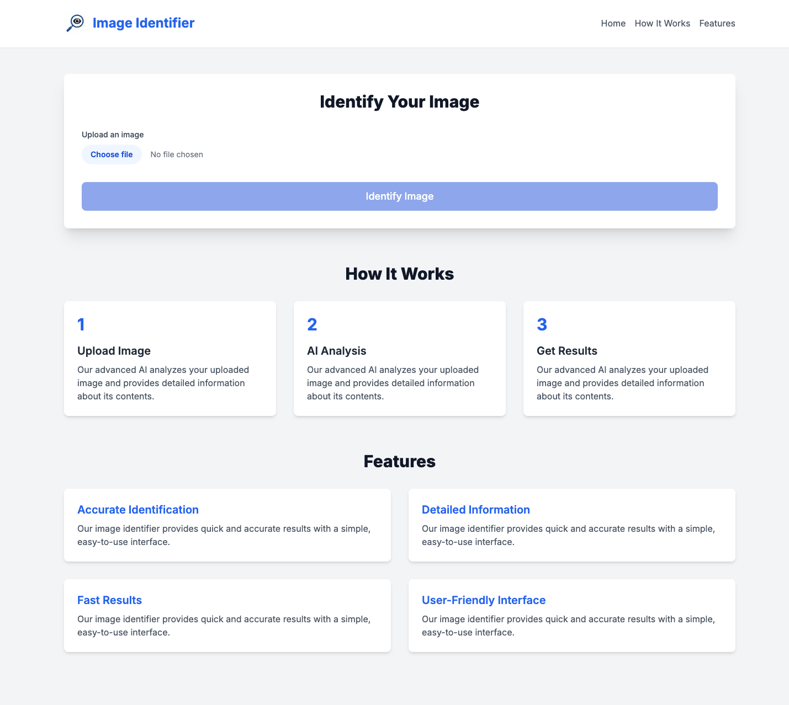
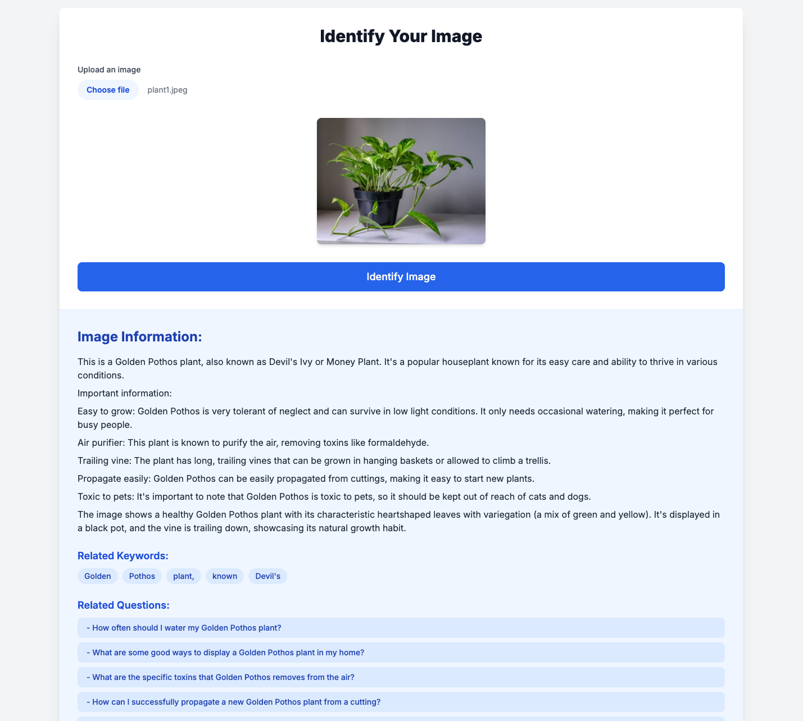

# Image Identifier AI

## Project Summary

This project presents an "Image Identifier" web application, crafted with Next.js, that leverages Google's Gemini AI to analyze uploaded images and deliver comprehensive details. It's designed for user-friendliness, allowing seamless image submission and providing in-depth AI-generated insights, including relevant keywords and follow-up questions for deeper exploration.

## Core Capabilities

* **Effortless Image Upload:** Easily upload images for analysis.
* **Intelligent Image Analysis:** Utilizes the Google Gemini API for powerful image interpretation.
* **Rich Information Display:** Presents detailed data about the identified image.
* **Keyword Generation:** Automatically suggests related keywords to enhance understanding.
* **Interactive Questioning:** Generates insightful questions based on the image analysis for further inquiry.
* **Adaptive Design:** Ensures optimal viewing and functionality across various devices.

## Technology Foundation

* **Framework:** Next.js 14 (React)
* **Language:** TypeScript
* **Styling:** Tailwind CSS
* **AI Integration:** Google Generative AI (Gemini API)

## Operational Flow

1.  **Image Submission:** Users initiate the process by uploading an image via the `ImageUploader` component.
2.  **AI Processing:** The application transmits the uploaded image to the Gemini AI API for detailed analysis.
3.  **Result Presentation:** The AI's generated information is then clearly presented within the `ResultDisplay` component.
4.  **Keyword Extraction:** Key terms from the AI's response are identified and displayed.
5.  **Question Generation:** The system uses a secondary AI query to formulate and present relevant questions about the image.
6.  **Content Refinement:** Users can click on any generated keyword to re-analyze the image with a specific focus on that aspect.
7.  **Targeted Information Retrieval:** Clicking on a generated question prompts the AI to provide more specific answers about the image.

## Getting Started

To set up and run the project locally, follow these steps:

1.  Obtain the project files by cloning the repository.
2.  Install the necessary dependencies using npm: `npm install`.
3.  Configure your environment:
    * Create a file named `.env.local` in the root directory.
    * Add your Google Gemini API key: `NEXT_PUBLIC_GOOGLE_GEMINI_API_KEY=your_api_key_here`.
4.  Start the development server: `npm run dev`.
5.  Access the application in your web browser at `http://localhost:3000`.

## Deployment Ready

This application is configured for easy deployment on platforms such as Vercel or Netlify. Remember to configure your Google Gemini API key as an environment variable within your chosen deployment platform's settings.

## Live Demonstration

Experience the application in action here: [Image Analyzer Live Demo](https://image-analyzer-lemon.vercel.app/)

## Planned Enhancements

* Implement user authentication for personalized user experiences.
* Introduce features for image categorization and tagging.
* Develop a gallery to store and display previously analyzed images.
* Enhance performance to expedite image processing times.
* Incorporate support for multiple languages to cater to a global audience.

## Visuals

## After image analysis

